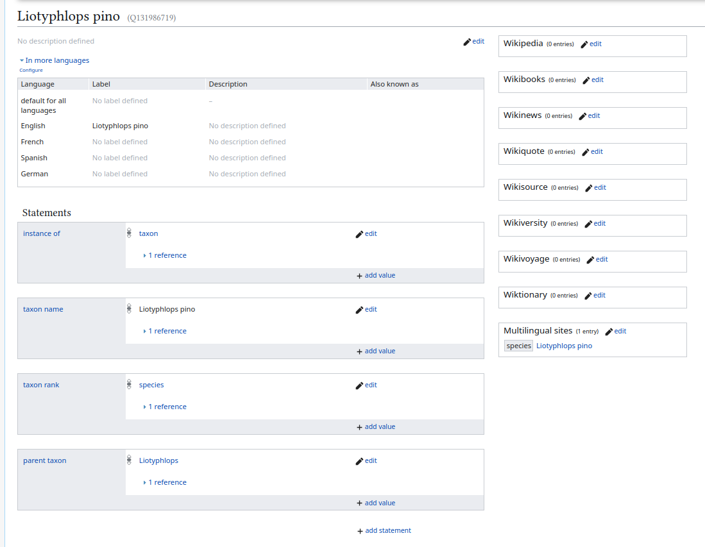
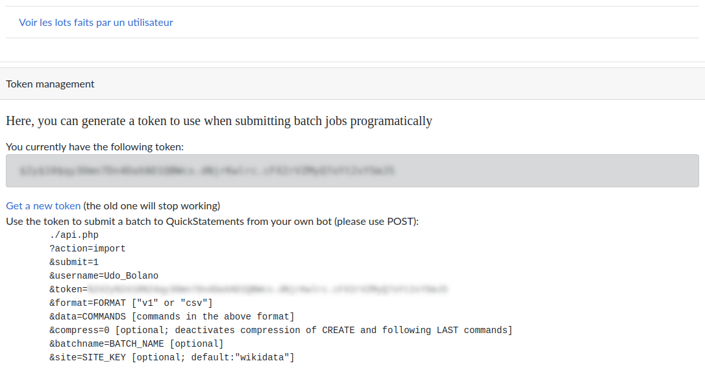
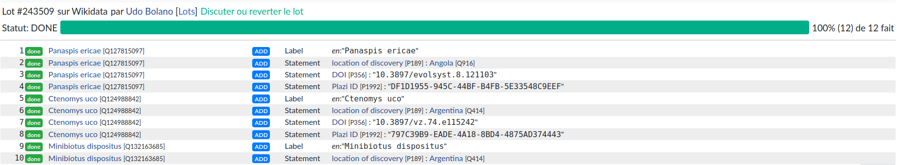

# introduction

Les données sur les espèces biologiques, à l'instar de toutes les autres données de recherche doivent être FAIR (Findable, Accessible, Interoperable, Reusable).
Depuis 2008, la fondation à but non lucratif Plazi Verein qui réunit des chercheurs et chercheuses dans le domaine de la biodiversité et des professionnels de l'information maintiennent une banque de données sur les espèces, la \*Treatment Bank" Cette base de données librement accessible sur le web contient des informations sur un nombre croissant d'espèces et accorde à chacune un identifiant unique et pérenne qui permet de les identifier sans ambiguité et sur le temps long.

Depuis quelques temps, Plazi tient un compte sur le Fédivers (Mastodon) et y publie des informations sur les dernières espèces.
Ces informations comprennent entre autres informations le nom de l'espèce, le lieu de découverte, l'identifiant de l'espèce dans la base de données Plazi et la publication dans laquelle cette découverte est mentionnée.


Le Fédivers est un réseau structuré par un protocole de communication (ActivityPub) qui permet de faire communiquer plusieurs serveurs entre eux ; il s'agit d'une architecture décentralisée à laquelle les utilisateurs peuvent avoir accès au moyen de logiciels orientés vers le partage de vidéos (PeerTube), de photos (Pixelfeld) ou de messages (Diaspora et Mastodon).
Ces logiciels se présentent comme des alternatives transparentes, libres, éthiques et décentralisées aux plateformes qui, selon Cédric Durand, constituent le fer de lance du techno-féodalisme (à savoir réspectivement Youtube qui appartient à Google, Instagram qui appartient à Meta, et Facebook, Twitter ou LinkdedIn respectivement les propriétés de Mark Zuckerberg, d'Elon Musk et de Ryan Roslansky).
En outre, tandis qu'il est devenu très compliqué et coûteux d'obtenir de façon automatisée des masses de tweets, extraire des corpus de messages envoyés sur le Fédivers se fait au moyen d'API gratuites et abordables sur le plan technique par des non connaisseurs de ce réseau.

Contrairement à Bluesky qui utilise un autre protocole (AT) pouvant potentiellement fonctionner de manière décentralisée, la décentralisation de Mastodon est achevée et les instances qui hébergent les comptes sont diverses, communiquent entre elles et appartiennent tantôt à des particuliers, tantôt à des instiutions.
Pour héberger son compte sur Mastodon, Plazi Verein a choisi l'instance mastodon.green.
Cette instance est administrée par Johan Empa, un consultant qui travaille à réduire les émissions de gaz à effets de serre du numérique dans les organisations et les entreprises européennes.
Il y a une certaine cohérence dans le choix de cette association en faveur de la biodiversité à investir un réseau qui promeut et encourage la diversité des contenus par la décentralisation.
Cette cohérence se retrouve dans le choix d'un outil pleinement transparent (si on compare par exemple le fonctionnement de Mastodon à l'algorithme de X) pour contribuer à la FAIRisation des données relatives à la bibliodiversité.

# 1. De Mastodon à Wikidata

Wikidata est souvent présentée comme la base de données qui soutend son projet frêre, l'encyclopédie Wikipédia.
Wikidata est une ontologie universelle qui a au fil des ans pris une importance croissante dans le monde universitaire.
A titre d'exemple, la base bibliométrique *open source* OpenAlex intègre depuis deux ans 66 000 concepts provenant de Wikidata.
Les identifiants uniques de Wikidata permettent d'identifier de manière sûre et durables les objets de recherche et peuvent être alignés avec un grand nombre d'autres identifiants issus d'ontologies spécifiques propres à telle ou telle science.

Wikidata est une base en constant développement, et à la différence de Plazi qui est une base gérée par des professionnels de l'information membres d'une association, tout le monde peut y contribuer.
Nous avons constaté que les dernières entrées dans la base Plazi n'avaient pas systématiquement fait l'objet de créations d'éléments dans Wikidata, ou bien que certaines des informations qui accompagnaient les messages postés sur Mastodon comportaient des informations standardisées dont on pouvait se servir pour enrichir les éléments qui auraient déjà été créés dans la base Wikidata.
Nous avons aussi constaté que les messages envoyés par Plazi sur Mastodon qui annonçaient la découverte de nouvelles espèces répondaient à une structure presque intangible qui facilitaient grandement l'extraction de ces informations standardisées et leur traitement dans un outil comme R.
Enfin, nous avons récemment découvert deux outils conçus pour R qui permettent l'un d'extraire de manière automatisée les messages postés -dans le vocabulaire de Mastodon on parle de "toots"- sur Mastodon par un utilisateur ou bien sur une instance donnée.
Il s'agit du [package R Rtoot](https://www.rdocumentation.org/packages/rtoot/versions/0.3.4), l'autre qui permet d'extraire des données de Wikidata et dans l'autre sens d'y réaliser des modifications de masse.
Ces modifications peuvent être des créations d'éléments ou bien des enrichissements ("*statements*").
Ce deuxième package conçu pour R est [WikidataR](<https://www.rdocumentation.org/packages/WikidataR/versions/2.3.3>.

Pour les personnes qui ne sont pas familières de la façon dont sont structurées les informations sur Wikidata, voici un exemple :


Cette nouvelle espèce de serpent dont la découverte a été annoncée sur Plazi en janvier 2024 a suscité un an plus tard la création d'un élément dans Wikidata [par un.e internaute](https://www.wikidata.org/w/index.php?title=Q131986719&action=history).
Voilà comment se présente cet élément :



Le taxon et le taxon parent sont des *statements*.
Il est possible à n'importe qui de rajouter des enrichissements en cliquant en bas sur le bouton "add statement".
On pourrait, par exemple, enrichir à la main cette page avec les informations contenues dans le toot de Plazi :

-   ajouter le lieu de la découverte (Honduras)
-   ajouter l'identifiant de la publication dans laquelle cette espèce est décrite
-   ajouter le taxon (qui ne se distingue pas du nom donné à l'espèce et donc au titre ou label de cet élément)
-   ajouter le numéro de traitement dans la base Plazi, afin -comme dans le cas du DOI- que le lecteur ou la lectrice de cette page puisse accéder facilement à de l'information complémentaire de niveau scientifique.

En revanche, il faudrait un temps considérable pour créer ou enrichir à la main tous les éléments dans Wikidata relatifs aux nouvelles découvertes publiées sur le compte Mastodon de Plazi (il y en a à ce jour près de 200).
Notre but est d'automatiser et ce document expose une méthode pour y parvenir.

La méthode que nous allons suivre est par conséquent la suivante :

1.  Utiliser Rtoot pour extraire tous les *toots* de Plazi annonçant l'intégration dans la "treatment bnak" de nouvelles espèces découvertes, et importer ces données dans R.
2.  Traiter ces messages, en utilisant divers packages de R afin de parser le contenu de ces messages pour en extraire les informations susceptibles de permettre la création ou l'enrichissement des éléments Wikidata relatifs à ces espèces nouvellement apparues.
3.  Mettre en forme ces informations de sorte à pouvoir au moyen d'une modification de masse ("bulk quick statement") pouvoir les envoyer sur Wikidata. Cela se fera au moyen du package WikidataR et en deux temps : tout d'abord la création d'éléments Wikidata pour les espèces qui n'en disposent pas encore, ensuite, si des éléments Wikidata correspondent déjà à ces espères nouvellement traitées par Plazi, enrichir ces éléments en utilisant pour cela le contenu extrait des messages de l'association.

# 2. Récupération des toots de Plazi

> **Compétences**
>
> 👉 Utiliser Rtoot pour récupérer des messages de Mastodon

Nous pouvons commencer par installer les deux *packages* que nous avons mentionnés dans R.
Cela peut se faire à partir de l'[archive CRAN](https://cran.r-project.org/) :

``` shell

install.packages("rtoot")
install.packages("WikidataR")
# bien respecter la casse dans WikidatR : la première et dernière lettre sont des majuscules
```

Puis nous pouvons importer ces packages dans le script :

```{r}
library(WikidataR)
library(rtoot)

```

David Schoch et Chung-Hong Chan sont à l’origine du package Rtoot conçu pour R qu’ils ont présenté dans les colonnes de la revue Mobile Media & Communication (@schochSoftwarePresentationRtoot2023b).
Comme une partie des requêtes possibles par API nécessite une authentification, ce package gère cette authentification au moyen d’un token qui peut être obtenu quand on est connecté à son compte.
Il faut donc disposer d'un compte Mastodon pour réaliser ce qui suit.
Ce compte peut-être créé facilement et immédiatement sur l'une des plus larges instances, [Mastodon.social](https://mastodon.social/explore) ou bien sur mastodon.green, si vous faites le même choix que Plazi.

Nous avons divisé le script de l'ensemble de cette opération en plusieurs mini-programmes (dans le vocabulaire de R, on parle de "*chuncks*"), de telle sort qu'il soit plus facile aux personnes qui souhaitent le réutiliser de le prendre en main.

Les commandes qui déclenchent ce processus d’authentification sont indiquées ci-dessous :

```{r authentification à l\'API récupération de l\'identifiant Plazi, eval=FALSE}
library(rtoot)
auth_setup() # authentification de l'utilisateurice
# la documentation est accesible icihttps://www.rdocumentation.org/packages/rtoot/versions/0.3.4
id <- search_accounts("plazi_species")
```

Ce *chunck* permet de s'authentifier pour accéder à l'API de Mastodon.
Il faut donc que le compte Mastodon de l'utilisateurice soit ouvert.
Un prompt lui est envoyé pour qu'il.elle insère le nom de l'instance qui héberge ce compte (mettre le nom entre guillements : par exemple "mastodon.social") Choisir 2:user Cette action ouvre un popup dans R et dans le navigateur une demande d'autorisation à accepter pour relier autoriser l'usage de l'API par le compte.
Accepter l'autorisation et copier le jeton obtenu suite à l'acceptation pour le placer dans le popup côté R.
La suite du script peut ensuite être exécutée.
Elle vise à trouver l'idenfiant du compte de Plazi sur Mastodon à partir de son nom ("plazi_species").
Cet identifiant est nécessaire pour les opérations suivantes, en particulier la récupération de messages provenant de ce compte.

le *chunk* suivant permet de collecter tous les *toots* envoyé par Plazi sur Mastodon.

```{r récupération des toots de Plazi, echo=FALSE, message=FALSE, warning=FALSE, paged.print=FALSE}
library(rtoot)
df <- get_account_statuses("109284766172512524", limit = 400L) # chnager la limite po
head(df$content, 1)
```

le pavé ci-dessus correspond au contenu de l'un des messages envoyés par Plazi sur Mastodon.
Ce contenu est presque illisible à cause de l'abondance des balises html.
On discerne quand même le nom de l'espèce séparé du reste du texte par deux balises p en amont et en aval.
Utiliser ces balises est nécessaire pour extraire cette information.
Les autres informations pourront être extraites une fois que le texte des messages aura été "nettoyé", débarrassé des éléments de la syntaxe html.

         
>**Compétences**
>
>👉 Utiliser des expressions régulières pour extraire d'un texte des chaînes de caractère
>
>👉 Supprimer des lignes qui ont une certaine valeur pour une variable donnée  


Pour extraire le nom de l'espèce qui se situe entre \</\p\>\<\p\> et \<\p\>\</\p\>, on va utiliser une première regex ("expression régulière") et l'extraction se fera au moyen du package *stringr*.
Les caractères extraits du corps du texte, c'est-à-dire, le nom de l'espèce, vont remplir une nouvelle colonne qui est ajoutée au moyen du package *dplyr*.

```{r récupération espèce, echo=TRUE, message=FALSE, warning=FALSE}
library(stringr)
library(dplyr)
pattern <- "(?<=</p><p>)(.*?)(?=</p><p>)"
df <- df %>%
  mutate(species_name = str_extract(content, pattern))  
#str_to_sentence(country_discovery$country_of_discovery)
head(df[30:30], 10) # affichage des 10 premiers résutlats au niveau de la colonne 30 qui comporte le nom des espèces 
```

Si l'on observe les 10 premiers résultats de la nouvelle colonne formée (la trentième), on constate que certains items ne sont pas des espèces mais comportent du texte encadrant l'identifant de l'espèce dans le registre de Plazi (Treatment suivi d'un lien html qui comporte cet identifiant).
Cette particularité concerne les végétaux, comme dans les exemples suivants :

[https://mastodon.green/\@plazi_species/113917317111853431](https://mastodon.green/@plazi_species/113917317111853431){.uri} [https://mastodon.green/\@plazi_species/113916252425285117](https://mastodon.green/@plazi_species/113916252425285117){.uri}

D'ordinaire la syntaxe des *toots* de Plazi se présente sous la forme d'un texte qui comporte peu de variations :

| 1\. hashtag Nouvelle espèce | 2\. un nouvel <animal> | 3\. découvert en <pays> | 4\. vient juste de ramper / bondir / voler, etc. jusqu'ici | 5\. <espèce> | 6\. traitement :<identifiant plazi> | 7\. publication : \<doi de la publication |
|:----------|:----------|:----------|:----------|:----------|:----------|:----------|
| #NewSpecies! | New rock gecko from | #thailand | just rocked in: | Cnemaspis enneaporus | Treatment: <https://treatment.plazi.org/id/9A67AE1B-A1A0-55B2-8B6B-EA350C541DA5> | Publication: <https://doi.org/10.3897/zookeys.1226.1> |

Mais pour ces messages où l'identifiant de traitement se substitue à l'espèce, la structure est un peu différente :

| 1\. hashtag Nouvelle espèce | 2\. <espèce> | 3\. taxon parent | 4\. <pays> d'origine de la découverte | 5\. traitement :<identifiant plazi> | 6\. publication : \<doi de la publication |   |
|:----------|:----------|:----------|:----------|:----------|:----------|:----------|
| #NewSpecies! | Clematis pengii | New ranunculaceae | from #taiwan! | Treatment: treatment.plazi.org/id/B4478577-C711-F54E-FF1F-AE04FE9254DF | Publication: doi.org/10.11646/phytotaxa.662.1.2 |  |

C'est l'identifiant du traitement qui se trouve pris entre les balises déjà évoquées.
Cette deuxième disposition concerne des espèces végétales exclusivement.
Nous décidons pour le moment de ne pas les intégrer.
Pour cela nous utilisons la fonction filter du package dplyr et une fonction du package dplyr pour supprimer les résultats qui comportent le terme Treatment dans la colonne "Eespèces" (species_name) nouvellement créée :

```{r exclusion espèces végétales, echo=TRUE, message=FALSE, warning=FALSE}
library(stringr)
library(dplyr)

df <- df %>%
  filter(!str_detect(species_name, 'Treatment:'))
head(df[, 30:30], 10)

```


>**Compétences**
>
>👉 Utiliser la fonction *html_text* du package *Rvest* pour supprimer des balises html d'un texte
>
>👉 Utiliser la fonction *str_to_title* de *stringr* pour restaurer la majuscule à l'initiale des noms de pays
>
>👉 Utiliser des expressions régulières pour isoler du texte qui répond à une forme rigide (numéro de matricule)


Le reste du contenu des messages (colonne "content"), du moins les informations qui nous intéressent et dont nous allons nous servir pour enrichir Wikidata, peuvent être isolées et extraites sans l'aide de balises html (les regex pourront intégrer des éléments du texte).
On se propose donc à l'étape suivante de *parser* tous ces messages pour en supprimer tous les éléments de formatage en html.
Nous suivons en cela la méthode présentée par Stochastics (@stochasticsInteractingMastodonAPIa).
Nous aurons besoin pour réaliser cette tâche de deux nouveaux packages : *purrr* et *rvest*.

```{r suppression des balises html dans les messages, echo=TRUE, message=FALSE, warning=FALSE}
library(purrr)
library(rvest)
df$content <- map_chr(df$content, function(x) {
  tryCatch({
    read_html(x) %>% html_text()
  }, error = function(e) {
    # renvoie le message original si une erreur est rencontrée
    return(x)
  })
})
head(df$content, 4)
```

Voici les 4 premiers éléments de la liste dans ce nouveau format épuré.
On y voit désormais quand même plus clair, n'est-ce pas ?
On va désormais extraire les noms des pays où la découverte a eu lieu.
Ces noms sont cités après un hashtag et la préposition *from*.
Nous construisons notre regex à partir de ces éléments :

```{r récupération pays de découverte, echo=TRUE, message=FALSE, warning=FALSE}
library(stringr)
pattern <- "(?<=from #)(\\w+)" # capture le mot qui vient après l'expression régulière "from #"
df <- df %>%
  mutate(
    country_of_discovery = str_extract(content, pattern),
    country_of_discovery = str_to_title(country_of_discovery) #str_to_title permet de restaurer la majuscule à l'iniotiale des noms de pays.
  )
head(df[, 30:31], 10)
```

Avec la fonction de *stringr* "str_to_title" on a au passage restauré la majuscule à l'initiale du nom de pays qui avait disparu dans le message posté sur Mastodon.

On va procéder de manière similaire pour extraire de la colonne "content" les DOI et les identifiants de la base Plazi.
pour former l'expression régulière concernant les DOIs, on va s'aider du suffixe doi.org/ Pour les identifiants Plazi, on observe que leur structure est relativement rigide : même nombre de caractères, même manière de scinder ces caractères en groupes de caractères de 8, 4, 4 et 12 groupes de caractères séparés par des tirets demi-cadratins (-)

```{r récupération DOIs et Plazi IDs, echo=TRUE, message=FALSE, warning=FALSE}
library(stringr)
pattern_doi <- "(?<=doi.org/)(.*?)(?=#)" #regex pour extraire les doi
pattern_plazi <- "[A-Za-z0-9]{8}-[A-Za-z0-9]{4}-[A-Za-z0-9]{4}-[A-Za-z0-9]{4}-[A-Za-z0-9]{12}" # regex pour extraire les identifiants Plazi
df <- df %>%
  mutate(
    doi = str_extract(content, pattern_doi), #crée une colonne pour les DOI
  plazi = str_extract(content, pattern_plazi) #crée une colonne pour les identifiants plazi
    )  
head(df[,30:33], 10)
```

la fonction head(df[,30:33], 10) ne représente que les 10 premiers éléments des colonnes 30 à 34 de notre tableau df (pour *dataframe*) Mais df comprend encore toutes les autres colonnes dont nous n'aurons plus besoin.
Nous pouvons donc nous en débarrasser au moyen d'une sélection de ces seules colonnes qui sont utiles à conserver (fonction *select*) Nous ajoutons au passage une colonne *taxon* qui reprend simplement le nom de l'espèce.
En effet, un élément Wikidata utilise deux fois le nom de l'espèce : pour le label (= nom de l'élément, par défaut en anglais, même s'il s'agit ici en fait de latin) et pour le taxon.

```{r sélectionner les colonnes importantes pour nous, echo=TRUE, message=FALSE, warning=FALSE}
library(dplyr)
df <- df %>%
  mutate(taxon = paste0(species_name))
df <- select(df, species_name, taxon, country_of_discovery, doi, plazi)
head(df,5)
```

# 3. Préparer les données en vue de leur envoi vers Wikidata

## 3.1 Qu'est-ce qu'un statement (architecture de la wikibase de Wikidata)

         
>**Compétences** 

>👉 Comprendre comment sont agencés les items et les propriétés ainsi que leurs valeurs dans les éléments de Wikidata  
>
>👉 Utiliser des identifiants de noms de pays, plutôt que des noms de pays pour enrichir Wikidata sans faire d'erreur   
>
>👉 S'initier à la structuration des requêtes Sparql dans Wikidata 
>
>👉 Maîtriser l'usage de WikidataR pour l'envoi de requêtes en Sparql vers Wikidata
>
>👉 Fusionner deux tables à partir d'une colonne pivot identique dans les deux


Wikidata est la plus grande instance existante du logiciel Wikibase.
Wikibase agence les éléments selon des propriétés.
On parle de triplet.
Un *statement* est l'action consistant à ajouter une propriété et un élément relatif à un élément existant.

Par exemple, l'araignée *Sinodromus fujianensis* a été découverte en Chine est un *statement* qui associe à l'élément [Q131545573 "Sinodromus fujianensis"](https://www.wikidata.org/wiki/Q131545573) la propriété [P189 "Pays de découverte"](https://www.wikidata.org/wiki/Property:P189) qui correspond à l'élément [Q148 "République Populaire de Chine](https://www.wikidata.org/wiki/Q148). Cette relation illustre bien le modèle employé par la base de données :

Q(élément) \> P(propriété) \> Q(élément)

Si l'on rapport ce modèle aux informations que l'on a déjà extraites des toots de Plazi, nous avons donc le schéma suivant :

| élément Q | Propriété P | élément Q ou chaîne de caractères |
|:----------------------:|:----------------------:|:----------------------:|
| une espèce donnée | Len (le nom en langue anglaise) | le nom de l'espèce (une chaîne de caractères) |
| la même espèce | P189 (a été découvert dans un pays) | le nom du pays (un élément Q) |
| la même espèce | P225 (a pour nom de taxon) | le nom de l'espèce (une chaîne de caractères) |
| la même espèce | P356 (a pour DOI) | le DOI de l'article dans lequel la découverte a été consignée |
| la même espèce | P1992 (a pour identifiant dans la base Plazi) | l'identifiant de la base Plazi |

Ajouter un *statement*, c'est ajouter une propriété et une valeur reliée à cette propriété à un élément.

## 3.2 assigner des éléments pays à la liste de pays obtenus via Mastodon

Si l'on veut ajouter à Wikidata le statement "l'araignée Sinodromus Fujinianensis a été découverte en Chine", il faut prendre en garde a bien relier le bon élément (araignée Sinodromus) à la bonne entité "République Populaire de Chine".
Si l'on envoie cette information via une chaîne de caractères (en conservant le terme "China" présent dans le message posté sur Plazi), on pourrait potentiellement relier cette araignée à plusieurs éléments :

-   1 People's Republic of China (Q148)\
-   2 mainland China (Q19188)\
-   3 porcelaine (en anglais "china") (Q130693)\
-   4 China (Q942154)

Le 1 est ce qui convient le mieux (entité territoriale le 2 est un concept politique (la Chine sans Taïwan, ce qui suppose que la Chine soit la Chine "réunifiée" avec Taïwan) le 3 est un objet en porcelaine (qu'en anglais on nomme effectivement : china) le 4 est une localité mexicaine de la province du Nuevo Léon.

Il y a un risque non négligeable qu'un processus automatisé d'information en direction de Wikipédia traite une chaîne de caractère comme China de telle sorte qu'un élément comme celui de cette municipalité mexicaine lui soit associé, en lieu et place de celui qui était visé.
Pour éviter cela, nous allons croiser les noms de pays obtenus avec la liste des entités de pays que nous pourrons obtenir de Wikidata.

Pour obtenir cette liste, il est nécessaire d'envoyer une requête via WikidataR.

Ce package comporte une fonction de requêtage qui procède de la manière suivante :

``` txt

liste_elements <- query_wikidata(' 

placer ici une requête en SPARQL

')
```

Le SPARQL est le langage de requête utilisé pour interroger des bases comme Wikipedia Nous ne pouvons pas ici nous y attarder, nous nous contenterons de commenter les étapes de cette requête :

``` txt
SELECT ?item ?itemLabel           # sélectionne les items qui réalisent la condition ci-dessous et affiche leur item (QID) et leur label (=nom du pays)
WHERE
{

     ?item wdt:P31 wd:Q6256 .     # les éléments sont (P31) des pays (Q6256)
           
              SERVICE wikibase:label { bd:serviceParam wikibase:language "en". # saisit les labels anglophones des éléments en question 
```

Les résultats ne sont pas les identifiants eux-mêmes mais des URL (<http://www.wikidata.org/entity/Q16> pour le Canada par exemple) qui comportent ces identifiants (Q16).
Nous rajoutons donc un bout de code qui permet de séparer le nom de domaine de ces URL des identifiants dont nous avons besoin et obtient de cette manière une nouvelle colonne "qid" qui recense les identifiants de cette liste de pays.

Pour lier ce tableau des pays au précédent tableau, il faut disposer d'une colonne pivot qui doit porter le même nom dans les deux cas.
Ainsi dans le dataframe "countries_id", on peut soit renommer la colonne ItenLabel en "country_of_discovery" qui est déjà présente dans l'autre tableau (df), soit copier-coller le contenu de la colonne "itemLabel" héritée de l'interrogation en Sparql dans une nouvelle colonne qu'on va nommer "country_of_discovery".
Nous avons choisi la deuxième voie.

```{r récupérer la liste des identifiants de tous les pays recensés dans Wikidata, echo=TRUE, message=FALSE, warning=FALSE}
library(WikidataR)
library(WikidataQueryServiceR)
library(dplyr)
# URL to this query on Wikidata query service
countries_qid <- query_wikidata('
SELECT ?item ?itemLabel
WHERE
{

     ?item wdt:P31 wd:Q6256 .
           
              SERVICE wikibase:label { bd:serviceParam wikibase:language "en". }
}')
qid_no_url <- gsub('[http://www.wikidata.org/entity/]', '', countries_qid$item) # extrait le qid de la colonne item et ajoute une colonne au tableau des pays
countries_qid <- as.data.frame(countries_qid) # fait de countries_qid2 un dataframe afin que mutate puisse fonctionner (ligne suivante)
countries_qid <- countries_qid %>% 
  mutate(
    qid=qid_no_url,
    country_of_discovery = paste(countries_qid$itemLabel)
    )
        
head(countries_qid, 10)
```

Le code suivant fait la jointure entre les deux tableaux sur la base de leur colonne commune "country_of_discovery".
Dorénavant, dans le document maître (désormais appelé df1), lorsque la découverte a eu lieu au Canada, la valeur Q16 désignant le Canada et provenant du tableau issu de Wikidata sera affectée à l'item correspondant (l'espèce découverte au Canada).

```{r jonction des deux tableaux, echo=TRUE, message=FALSE, warning=FALSE}

df1 <- merge(df, countries_qid, by = "country_of_discovery")
df1 <- select(df1, species_name, taxon, qid, country_of_discovery, doi, plazi)
head(df1, 10)

```

# 3.3 Créer ou enrichir


>**Compétences** 
>
>👉 Avec la fonction find_item() de WikidataR, obtenir à partir d'un vecteur comportant des identifiants Wikidata la liste des éléments déjà présents dans la wikibase  
>  
>👉 comprendre la structure d'une commande pour éditer des éléments Wikidata (fonction write_wikidata()) 
>  
>👉 rédiger une commande pour éditer en masse dans Wikidata  


L'envoi groupé d'informations vers Wikidata n'est pas géré de la même manière par le package WikidataR selon qu'il s'agisse de créations (les éléments ne sont pas déjà présents dans Wikidata) ou bien d'enrichissements (les éléments sont présents, on les enrichit par de nouveaux *statements*) Il va falloir intégrer cette donnée dans notre tableau principal (df1).
Pour cela, pour chaque nom d'espèce que contient le tableau, on va interroger Wikidata pour savoir s'il y a un élément correspondant avec la fonction *find_item* du package WikidataR, comme indiqué dans le script suivant :

```{r récupération des items qui existent déjà dans Wikidata, echo=TRUE, fig.width=12, message=FALSE, warning=FALSE}

get_qid <- function(name) {
  results <- find_item(name)  # Search for the name in Wikidata
  if (length(results) > 0) {
    return(results[[1]]$id)  # Extract QID of the first result
  } else {
    return(NA)  # Return NA if no result is found
  }
}
df1$QID_items <- sapply(df1$species_name, get_qid)
head(df1, 10)
```

Dans la colonne QID_items, nous avons tantôt un identifiant unique d'élément de Wikidata (QID), tantôt nous n'avons rien.
Lorsque l'identifiant a été récupéré, c'est donc parce qu'un élément existe déjà qu'il conviendra d'enrichir avec de nouvelles propriétés Lorsque l'identifiant n'existe pas, c'est qu'il n'a pas encore été créé, il faudra le créer avec ses propriétés.

Maintenant que cette nouvelle colonne QID_items est créée, avec les identifiants de Wikidata quand les éléments sont déjà créés, vide (NA lorsque ces éléments n'ont pas encore été créés), on va pouvoir scinder ce tableau en deux : dans le premier (df2), les items qui n'ont pas encore été créés sur Wikidata, dans le second (df3) les items qui ont déjà été créés.
Créons déjà df2 :

```{r récupération des items qui ne sont pas présents dans Wikidata, echo=TRUE, message=FALSE, warning=FALSE}
#df2 : items à créer dans Wikdata
df2  <- df1[is.na(df1$QID_items),] # filter(df1 =="NA") won't do it (see here https://stackoverflow.com/questions/7980622/subset-of-rows-containing-na-missing-values-in-a-chosen-column-of-a-data-frame#7980765)
head(df2, 10)

```

## 3.4 Constitution d'un tableau d'éléments à créer

Il est nécessaire à ce stade d'expliquer comment procéder l'envoi d'informations vers la wikibase au moyen du package WikidataR.
La fonction dont nous allons nous servir est [write_wikidata()](https://www.rdocumentation.org/packages/WikidataR/versions/2.3.3/topics/write_wikidata).
La syntaxe de base est la suivante :

``` txt

write_wikidata(
  items,                 # items = les identifiants Qids des éléments à modifier (cela suppose qu'ils ont déjà été créés)
  properties = NULL,
  values = NULL,
  qual.properties = NULL,
  qual.values = NULL,
  src.properties = NULL,
  src.values = NULL,
  remove = FALSE,
  format = "tibble",
  api.username = NULL,
  api.token = NULL,
  api.format = "v1",
  api.batchname = NULL,
  api.submit = TRUE
)
```

Supposons que nous disposiions d'un dataframe comportant dans une colonne item les identifiants des articles Wikidata de toutes les batailles qui ont eu lieu dans le Péloponnèse et dans le même dataframe une colonne value qui porte la date de chacune de ces batailles.
Dans ce cas, la

``` txt

item <- c(dataframe$item)  # liste des éléments relatifs aux batailles du Péloponnèse, par exemple  la bataille d'Aegos Potamos (Q866862) 
property <- "P585"     # Date de l'événement
value <- c(dataframe$date_iso)  # date en format ISO

library(WikidataR)
write_wikidata(items = item,
               properties = "P585",
               values = value,
               format = "api",
               api.username = "identifiant_utilisateur", 
               api.token = "mettre ici votre token")
```

Dans ce cas, les items sont pluriels (de même que les dates bien sûr), mais la propriété est unique.
Lorsque nous voulons faire des enrichissements sur plusieurs propriétés, il est plus commode de faire des ces propriétés elles-mêmes un vecteur.
C'est ce que nous faisons dans le *chunck* suivant.

La première ligne constitue un tableau extrait de df2.
Ce tableau ne comporte que les trois premiers enregistrements de df2.
En effet, pour plus de clarté, et dans l'optique de refaire cet exercice plusieurs fois, nous ne voulons pas traiter l'ensemble des items disponibles mais seulement une partie d'entre eux.
C'est aussi un principe de précaution que nous appliquons.
Il s'agit de créer des items qui n'existent pas encore dans Wikidata ; n'importe quel utilisateurice peut ajouter ou supprimer des *statements* à un ou plusieurs éléments de Wikidata.
Mais supprimer des éléments nécessite un compte d'administrateurice.
Il n'y a pas de retour en arrière possible pour le commun des mortels en cas d'erreur (même si les conséquences des erreurs sont limitées).
Donc autant être prudent et procéder avec un échantillon de trois items, pour vérifier que tout fonctionne et bien comprendre comment cela fonctionne.


>**Compétences** 
>
>👉 Faire pivoter un tableau avec la fonction *pivot_longer()* du package *Tidyr*   
>
>👉 récupérer le jeton depuis la forge *quickstatement* pour lancer la commande *write_wikidata* du package *WikidataR*


Les étapes qui suivent procèdent à la mise en forme de cette information pour qu'elle soit exploitable par la forge de Wikidata, c'est à dire pour qu'elles soient véritablement envoyées vers la base de Wikidata.
Pour ce faire, nous suivons la méthode adoptée par Katharina Brunner (@brunnerGetYourData).
Katharina Brunner est journaliste de données attachée à la radio bavaroise et a écrit sur son blog plusieurs articles intéressants sur les projets de la fondation Wikimedia (Wikipedia, Wikimetdia Commons, Wikidata) en lien avec R.

Cette méthode comporte deux temps principaux :

1.  renommer les colonnes pour qu'elles correspondent à des propriétés enregistrées dans Wikidata :

| colonne du tableau | propriété | commentaire |
|:-----------------------|:-----------------------|:-----------------------|
| CREATE\_ (suivi d'un numéro unique) | item | quand l'élément n'existe pas, l'item doit être créé avec la commande CREATE suivi d'un identifiant unique dans la liste des éléments à traiter |
| species_name | Len | label (=titre de l'élément en anglais) |
| qid | P189 | qid est l'identifiant récupéré de Wikidata correspondant au pays de découverte tel qu'indiqué dans Mastodon) |
| taxon | P225 | le taxon est l'équivalent du nom de l'espèce récupéré sur Mastodon |
| doi | P356 | le doi est celui de la publication à laquelle il est fait référence pour chaque découverte sur Mastodon |
| plazi | P1992 | il s'agit du matricule de traitement de l'espèce dans la banque de Plazi |

```{r selection des trois items de tête de la liste df2, echo=TRUE, message=FALSE, warning=FALSE}

df2_sub <- slice_head(df2, n = 3, by = NULL)
df2_sub <- df2_sub %>% 
  mutate(
    row_num = row_number(), # crée une colonne comportant le numéro de chaque item
    item = paste0("CREATE_",row_num), # crée une colonne item comportant le suffixe CREATE_ suivi du numéro de la colonne
    Len = paste0(df2_sub$species_name), # Crée la colonne Len (pour Langue anglaise) qui va servir à faire le label de l'élément Wikidata
    P225 = paste0(df2_sub$taxon),
    P189 = paste0(df2_sub$qid),
    P356 = paste0(df2_sub$doi),
    P1992 = paste0(df2_sub$plazi)
  )
df2_sub <- select(df2_sub, item, species_name, Len, P225, P189, P356, P1992) # sélectionne les colonnes à conserver
head(df2_sub, 10)

```

2.  Faire pivoter le tableau obtenu pour le faire correspondre au format d'import de Wikidata

En effet, tandis que nos candidats à l'envoi se présentent horizontalement avec toutes leurs propriétés sur une seule ligne et autant de colonnes qu'il y a de propriétés, la forge de Wikidata dans laquelle les imports se font dipose l'information de façon verticale :

**Dans R :**

| liste des éléments | liste des items | propriété 1 | propriété 2 | propriété 3 |
|:-------------------|:----------------|:------------|:------------|:------------|
| élément 1          | item            | propriété 1 | propriété 2 | propriété 3 |
| élément 2          | item            | propriété 1 | propriété 2 | propriété 3 |

**Dans la forge**

| élément   | propriété   |
|:----------|:------------|
| élémént 1 | item        |
| élément 1 | propriété 1 |
| élément 1 | propriété 2 |
| élément 1 | propriété 3 |
| élémént 2 | item        |
| élément 2 | propriété 1 |
| élément 2 | propriété 2 |
| élément 2 | propriété 3 |

Pour faire pivoter le tableau que nous avons obtenu et le formater de façon verticale, nous allons utiliser la fonction *pivot_longer* du package *tidyr* (encore un package à charger en cours de route)

```{r code de Katharina Brunner, echo=TRUE, message=FALSE, warning=FALSE}
library(tidyr)
library(stringr)

# voir méthode présentée par Katharina Brunner : https://katharinabrunner.de/2022/06/wikibase-wikidata-etl-data-import-with-r/ 

import <- df2_sub %>% 
  select(item, 
         matches("^L", ignore.case = FALSE), 
         matches("^D", ignore.case = FALSE), 
         # if there are some Sitelinks to other Wiki pages
         #matches("^S", ignore.case = FALSE), 
         matches("^P", ignore.case = FALSE)) %>% 
  pivot_longer(cols = 2:last_col(), names_to = "property", values_to = "value") %>% 
  # fix helper with two columns referring to the same property
  mutate(property = str_remove(property, "_.*")) %>% 
  filter(!is.na(value)) %>% 
  distinct()

head(import, 10)
```


## 3.5 Utiliser un token de Wikidata pour exporter des éléments vers la Wikibase

Toute modification de la Wikibase de Wikidata peut être faite à la main, et comme pour Wikipédia, il suffit pour cela d'avoir un ordinateur connecté à Internet, pas besoin de compte.
Toutefois, et c'est bien compréhensible, les modifications de masse sur Wikidata doivent être traçables.
Un compte est nécessaire ; si vous disposez déjà d'un compte utilisateur sur Wikipédia, vous pouvez vous en servir pour réaliser ce qui suit.
Ce compte vous permettra d'obtenir votre *token* pour faire l'export vers la Wikibase.

Aller sur le [site de Wikidata intitulé "QuickStatements"](https://quickstatements.toolforge.org/#/user) Se connecter avec son compte Une fois identifié, cliquer sur le nom du compte.
Un texte apparaît avec au milieu un encadré gris (flouté sur cette image) qui comporte votre *token* personnel (ne le laissez pas traîner dans votre code)



On peut désormais copier ce token et le coller dans le *chunk* ci-dessous :

```{r envoyer vers wikidata, echo=TRUE, eval=FALSE}
library(WikidataR)
write_wikidata(
  items        = import$item,
  properties   = import$property,
  values       = import$value,
  format       = "api",
  api.username = "votre nom d'utilisateur", 
  api.token    = "votre token", #api.token    = mettre ici le token récupéré sur https://quickstatements.toolforge.org/#/user
  )

#results ici : https://quickstatements.toolforge.org/#/batch/243495

```

Lorsque ce script est exécuté, vous pouvez suivre la progression de l'envoi sur le site QuickStatement.

Voici un rapport concernant trois espèces qui ont été créées sur Wikidata en suivant ce procédé :



## traitement des éléments qui sont déjà présents dans Wikidata


>**Compétences** 
>
>👉 Filtrer un tableau à partir de la valeur nulle dans une colonne donnée
>
<👉 insérer une liste dans une commande conçue pour la fonction *write_wikidata()*


df2 comportait des éléments qui n'étaient pas présents dans Wikidata, nous allons maintenant traiter les espèces qui ont déjà fait l'objet de créations dans la Wikibase de Wikidata.
Ces items vont être regroupés dans un *dataframe* que nous allons appeler **df3**

```{r récupération des items qui sont déjà présents dans Wikidata, echo=TRUE}
#df3 : items déjà créésdans Wikdata
df3  <- df1[!is.na(df1$QID_items),] # filter(df1 =="NA") ne va pas fonctionner dans ce cas (voir ici https://stackoverflow.com/questions/7980622/subset-of-rows-containing-na-missing-values-in-a-chosen-column-of-a-data-frame#7980765)
head(df3, 10)

```

Ce document présente une méthode pour envoyer régulièrement en groupes des informations provenant du compte Mastodon vers Wikidata.
Il faut dans la mesure du possible ne pas traiter à chaque fois l'ensemble des nouvelles espèces présentes dans l'ensemble des *toots* envoyés par Plazi sur Mastodon depuis la création du compte.
Réécrire des *statements*, refaire le travail à l'identique, n'est pas un problème en soi, puisque les informations ne sont pas dupliquées (il ne peut y avoir dans un élément de Wikidata deux fois ou plus la même propriété avec des valeurs identiques.) Toutefois ne pas traiter d'une fois sur l'autre les mêmes espèces sans y apporter aucun enrichissement est un gaspillage d'électricité.
On va donc exclure dans la liste df3 les éléments qui ont déjà été traités par nous.
Nous considérons qu'à part nous, peu de gens attribuent le pays de découverte (P189) au nouveau taxon.
Lorsque l'élément existe et que nous ne sommes pas à l'origine de sa création, nous remarquons que la propriété P189, n'y est jamais présente.
Nous considèrerons donc que si cette propriété est déjà présente, alors c'est que nous avons déjà traité l'élément.
Nous allons donc supprimer de la liste df3, les éléments qui dans Wikidata ont déjà la propriété 189.

Pour cela nous avons besoin de procéder en plusieurs étapes : 1.
Créer une liste de tous identifiants d'éléments (QID_items) disponibles dans df3 2.
Insérer cette liste dans une requête Wikidata 3.
Envoyer cette requête et récupérer les résultats dans un autre tableau (results) 4.
Dans ce tableau, les QID_items sont automatiquement renommés "items" ; on va les renommer QID_items pour être en mesure de réconcilier le tableau obtenu par la requête Wikidata et df3 qui comporte également la variable QID_items qui nous servira donc de pivot pour cette fusion.
5.
Exclure du tableau ainsi créé tous les éléments qui ont déjà une valeur à la colonne P189 (déjà traités) C'est ce que font les deux scripts suivants :

```{r echo=TRUE, message=FALSE, warning=FALSE}
library(WikidataR)
library(dplyr)

q_list <- c(df3$QID_items) # constitution d'une liste avec tous les identifiants de pays présents dans df1

qid_list <- c(paste0("wd:",q_list, collapse = " ")) # ajout du suffixe wd: aux identifiants de pays (pour que le vecteur soit conforme à la syntaxe de la requête dans Wiidata)


query_sparql <- paste0("SELECT ?item ?locationOfDiscovery 
WHERE {  
    VALUES ?item {", qid_list,"}
      OPTIONAL { ?item wdt:P189 ?locationOfDiscovery. }
SERVICE wikibase:label { bd:serviceParam wikibase:language 'en'. }
}")  # rédaction de la requête query_sparql en y insérant le vecteur des identifiants de pays avec leur suffixe wd:

results <- query_wikidata(query_sparql) # envoi de la requête vers Wikidata

names(results)[names(results) == 'item'] <- 'QID_items' # renommage de la colonne item en QID_items, nom de colonne commun avec df1 en vue d'une fusion des deux tableaux sur la base de cette colonne

df3 <- merge(df3, results, by = "QID_items") # fusion des deux tableaux
head(df3, 10)

```

filtrage de df3 pour ne retenir que les éléments qui ne disposent pas déjà de la propriété P189 :

```{r echo=TRUE, message=FALSE, warning=FALSE}
df3  <- df3 %>%
  filter(is.na(locationOfDiscovery)) # suppression des items qui ont déjà la propriété P189 (pays de découverte) avec un identifiant de pays

head(df3, 10) # affichage des 10 premiers résultats de la liste 
```

Maintenant que nous avons un tableau complet de tous les éléments déjà présents dans Wikidata et susceptibles d'être enrichis par des *statements* supplémentaires (ajout de propriétés et de leurs valeurs), nous allons constituer un sous-groupe de 3 items pour vérifier que notre envoi se déroule bien.

Il est temps à présent de suivre la même méthode de formatage qui a été déjà suivie plus haut.
A noter que les éléments n'étant pas à créer, nous n'allons pas utiliser la fonction qui crée pour chaque élément candidat à l'import un identifiant CREATE_N

```{r selection des trois items de tête de la liste df3, echo=FALSE}

df3_sub <- slice_head(df3, n = 3, by = NULL)
df3_sub <- df3_sub %>% 
  mutate(
    row_num = row_number(),
    Len = paste0(df3_sub$species_name),
    P189 = paste0(df3_sub$qid),
    P356 = paste0(df3_sub$doi),
    P1992 = paste0(df3_sub$plazi)
  )
df3_sub <- select(df3_sub, QID_items, species_name, Len, P189, P356, P1992)
head(df3_sub, 10)

```

il est temps de faire pivoter cette table :

```{r enrichissement, echo=TRUE, message=FALSE, warning=FALSE}
library(tidyr)
library(stringr)

import2 <- df3_sub %>% 
  select(QID_items, 
         matches("^L", ignore.case = FALSE), 
         matches("^D", ignore.case = FALSE), 
         # if there are some links to other Wiki pages
         #matches("^S", ignore.case = FALSE), 
         matches("^P", ignore.case = FALSE)) %>% 
  pivot_longer(cols = 2:last_col(), names_to = "property", values_to = "value") %>% 
  # fix helper with two columns referring to the same property
  mutate(property = str_remove(property, "_.*")) %>% 
  filter(!is.na(value)) %>% 
  distinct()

print(import2)

```

On peut désormais procéder à l'envoi avec le même compte et le même *token*.

```{r envoyer les enrichissements vers wikidata, echo=TRUE, eval=FALSE}
library(WikidataR)
write_wikidata(
  items        = import2$QID_items,
  properties   = import2$property,
  values       = import2$value,
  format       = "api",
  api.username = "votre nom d'utilisateur", 
  api.token    = "votre jeton là", #api.token    = mettre ici le token récupéré sur https://quickstatements.toolforge.org/#/user
  )

```

# Conclusion

A travers cette étude, nous allons voulu montrer à la fois l'intérêt d'un package R pour récupérer du contenu publié sur Mastodon directement dans R afin d'en faciliter le traitement et en même temps l'utilité du package WikidataR conçu pour récupérer des lots d'information depuis Wikidata, les traiter en local, pour les enrichir avec ses propres données, et restituer le tout à sa communauté au moyen d'une édition de masse.

Nous espérons ainsi contribuer à la fois à l'usage de Wikidata comme ontologie pivot dans la FAIRisation des données de recherche et à l'analyse des messages échangés sur le Fédivers qui constituent la seule réelle alternative décentralisée pour toutes celles et ceux, scientifiques ou amateurs et amantrices de sciences en particulier, qui ont du quitter les réseaux sociaux propriétaires devenus des foyers d'extrémisme et de propagation anti-science.

# Bibliographie
