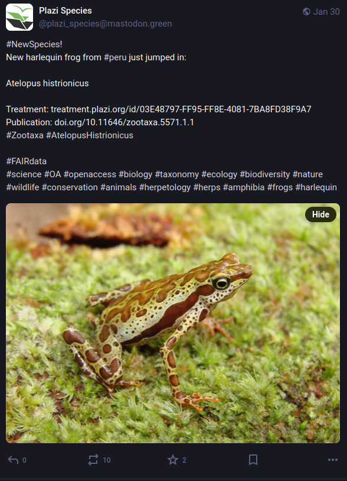

# introduction

Les données sur les espèces biologiques, à l'instar de toutes les autres données de recherche doivent être FAIR (Findable, Accessible, Interoperable, Reusable). 
Depuis 2008, la fondation à but non lucratif Plazi Verein qui réunit des chercheurs et chercheuses dans le domaine de la biodiversité et des professionnels de l'information maintiennent une banque de données sur les espèces, la *Treatment Bank"
Cette base de données librement accessible sur le web contient des informations sur un nombre croissant d'espèces et accorde à chacune un identifiant unique et pérenne qui permet de les identifier sans ambiguité et sur le temps long. 

Depuis quelques temps, Plazi tient un compte sur le Fédivers (Mastodon) et y publie des informations sur les dernières espèces. Ces informations comprennent entre autres informations le nom de l'espèce, le lieu de découverte, l'identifiant de l'espèce dans la base de données Plazi et la publication dans laquelle cette découverte est mentionnée. 


Le Fédivers est un réseau structuré par un protocole de communication (ActivityPub) qui permet de faire communiquer plusieurs serveurs entre eux ; il s'agit d'une architecture décentralisée à laquelle les utilisateurs peuvent avoir accès au moyen de logiciels orientés vers le partage de vidéos (PeerTube), de photos (Pixelfeld) ou de messages (Diaspora et Mastodon). Ces logiciels se présentent comme des alternatives transparentes, libres, éthiques et décentralisées aux plateformes qui, selon Cédric Durand, constituent le fer de lance du techno-féodalisme (à savoir réspectivement Youtube qui appartient à Google, Instagram qui appartient à Meta, et Facebook, Twitter ou LinkdedIn respectivement les propriétés de Mark Zuckerberg, d'Elon Musk et de )
Contrairement  à Bluesky qui utilise un autre protocole (AT) pouvant potentiellement fonctionner de manière décentralisée, la décentralisation de Mastodon est achevée et les instances qui hébergent les comptes sont diverses, communiquent entre elles et appartiennent tantôt à des particuliers, tantôt à des instiutions. 
Pour héberger son compte sur Mastodon, Plazi Verein a choisi l'instance mastodon.green. Cette instance est administrée par Johan Empa, un consultant qui travaille à réduire les émissions de gaz à effets de serre du numérique dans les organisations et les entreprises européennes. 
Il y a une certaine cohérence dans le choix de cette association en faveur de la biodiversité à investir un réseau qui promeut et encourage la diversité des contenus par la décentralisation. Cette cohérence se retrouve dans le choix d'un outil pleinement transparent (si on compare par exemple le fonctionnement de Mastodon à l'algorithme de X) pour contribuer à la FAIRisation des données relatives à la bibliodiversité. 

# 1. De Mastodon à Wikidata

Wikidata est souvent présentée comme la base de données qui soutend son projet frêre, l'encyclopédie Wikipédia. Wikidata est une ontologie universelle qui a au fil des ans pris une importance croissante dans le monde universitaire. A titre d'exemple, la base bibliométrique *open source* OpenAlex intègre depuis deux ans 66 000 concepts provenant de Wikidata. 
Les identifiants uniques de Wikidata permettent d'identifier de manière sûre et durables les objets de recherche et peuvent être alignés avec un grand nombre d'autres identifiants issus d'ontologies spécifiques propres à telle ou telle science. 

Wikidata est une base en constant développement, et à la différence de Plazi qui est une base gérée par des professionnels de l'information membres d'une association, tout le monde peut y contribuer. 
Nous avons constaté que les dernières entrées dans la base Plazi n'avaient pas systématiquement fait l'objet de créations d'éléments dans Wikidata, ou bien que certaines des informations qui accompagnaient les messages postés sur Mastodon comportaient des informations standardisées dont on pouvait se servir pour enrichir les éléments qui auraient déjà été créés dans la base Wikidata. 
Nous avons aussi constaté que les messages envoyés par Plazi sur Mastodon qui annonçaient la découverte de nouvelles espèces répondaient à une structure presque intangible qui facilitaient grandement l'extraction de ces informations standardisées et leur traitement dans un outil comme R. 
Enfin, nous avons récemment découvert deux outils conçus pour R qui permettent l'un d'extraire de manière automatisée les messages ("toots") postés sur Mastodon par un utilisateur ou bien sur une instance donnée. Il s'agit du [package R Rtoot](https://www.rdocumentation.org/packages/rtoot/versions/0.3.4), l'autre qui permet d'extraire des données de Wikidata et dans l'autre sens d'y réaliser des modifications de masse. Ces modifications peuent être des créations d'éléments ou bien des enrichissements ("statements"). Ce deuxième package conçu pour R est [WikidataR](https://www.rdocumentation.org/packages/WikidataR/versions/2.3.3. 

La méthode que nous allons suivre est par conséquent la suivante : 

1. Utiliser Rtoot pour extraire tous les *toots* de Plazi annonçant l'intégration dans la "treatment bnak" de nouvelles espèces découvertes, et importer ces données dans R. 
2. Traiter ces messages, en utilisant divers packages de R afin de parser le contenu de ces messages pour en extraire les informations susceptibles de permettre la création ou l'enrichissement des éléments Wikidata relatifs à ces espèces nouvellement apparues. 
3. Mettre en forme ces informations de sorte à pouvoir au moyen d'une modification de masse ("bulk quick statement") pouvoir les envoyer sur Wikidata. Cela se fera au moyen du package WikidataR et en deux temps : tout d'abord la création d'éléments Wikidata pour les espèces qui n'en disposent pas encore, ensuite, si des éléments Wikidata correspondent déjà à ces espères nouvellement traitées par Plazi, enrichir ces éléments en utilisant pour cela le contenu extrait des messages de l'association. 

# 2. Récupération des toots de Plazi 

Nous pouvons commencer par installer les deux *packages* que nous avons mentionnés dans R. 
Cela peut se faire à partir de l'[archive CRAN](https://cran.r-project.org/) : 

```shell

install.packages("rtoot")
install.packages("WikidataR")
# bien respecter la casse dans WikidatR : la première et dernière lettre sont des majuscules
```

Puis nous pouvons importer ces packages dans le script : 

```{r}
library(WikidataR)
library(rtoot)

```

David Schoch et Chung-Hong Chan sont à l’origine du package Rtoot conçu pour R qu’ils ont présenté dans les colonnes de la revue Mobile Media & Communication (@schochSoftwarePresentationRtoot2023b). Comme une partie des requêtes possibles par API nécessite une authentification, ce package gère cette authentification au moyen d’un token qui peut être obtenu quand on est connecté à son compte. Il faut donc disposer d'un compte Mastodon pour réaliser ce qui suit. Ce compte peut-être créé facilement et immédiatement sur l'une des plus larges instances, [Mastodon.social](https://mastodon.social/explore) ou bien sur mastodon.green, si vous faites le même choix que Plazi. 

Nous avons divisé le script de notre opération en plusieurs bouts ("chuncks"), de telle sort qu'il soit plus facile aux personnes qui souhaitent le réutiliser de le prendre en main. 

Les commandes qui déclenchent ce processus d’authentification sont indiquées ci-dessous :

```{r authentification à l\'API récupération de l\'identifiant Plazi, eval=FALSE}
library(rtoot)
auth_setup() # authentification de l'utilisateurice
# la documentation est accesible icihttps://www.rdocumentation.org/packages/rtoot/versions/0.3.4
id <- search_accounts("plazi_species")
```

Ce *chunck* permet de s'authentifier pour accéder à l'API de Mastodon. 
Il faut donc que le compte Mastodon de l'utilisateurice soit ouvert. Un prompt lui est envoyé pour qu'il.elle insère le nom de l'instance qui héberge ce compte (mettre le nom entre guillements : par exemple "mastodon.social")
Choisir 2:user
Cette action ouvre un popup dans R et dans le navigateur une demande d'autorisation à accepter pour relier autoriser l'usage de l'API par le compte. Accepter l'autorisation et copier le jeton obtenu suite à l'acceptation pour le placer dans le popup côté R. 
La suite du script peut ensuite être exécutée. Elle vise à trouver l'idenfiant du compte de Plazi sur Mastodon à partir de son nom ("plazi_species"). Cet identifiant est nécessaire pour les opérations suivantes, en particulier la récupération de messages provenant de ce compte. 

le *chunk* suivant permet de collecter tous les *toots* envoyé par Plazi sur Mastodon. 

```{r récupération des toots de Plazi, echo=TRUE, message=FALSE, warning=FALSE, paged.print=FALSE}
df <- get_account_statuses("109284766172512524", limit = 400L) # chnager la limite po
head(df$content, 1)
```
le pavé ci-dessus correspond au contenu de l'un des messages envoyés par Plazi sur Mastodon. Ce contenu est presque illisible à cause de l'abondance des balises html.
On discerne quand même le nom de l'espèce séparé du reste du texte par deux balises p en amont et en aval. 
Utiliser ces balises est nécessaire pour extraire cette information. Les autres informations pourront être extraites une fois que le texte des messages aura été "nettoyé", débarrassé des éléments de la syntaxe html. 

Pour extraire le nom de l'espèce qui se situe entre \<\/\p\>\<\p\> et \<\p\>\<\/\p\>, on va utiliser une première regex ("expression régulière") et l'extraction se fera au moyen du package *stringr*. Les caractères extraits du corps du texte, c'est-à-dire, le nom de l'espèce, vont remplir une nouvelle colonne qui est ajoutée au moyen du package *dplyr*.

```{r récupération espèce}
library(stringr)
library(dplyr)
pattern <- "(?<=</p><p>)(.*?)(?=</p><p>)"
df <- df %>%
  mutate(species_name = str_extract(content, pattern))  
#str_to_sentence(country_discovery$country_of_discovery)
head(df[30:30], 10) # affichage des 10 premiers résutlats au niveau de la colonne 30 qui comporte le nom des espèces 
```

Si l'on observe les 10 premiers résultats de la nouvelle colonne formée (la trentième), on constate que certains items ne sont pas des espèces mais comportent du texte encadrant l'identifant de l'espèce dans le registre de Plazi (Treatment suivi d'un lien html qui comporte cet identifiant).
Cette particularité concerne les végétaux, comme dans les exemples suivants : 

https://mastodon.green/@plazi_species/113917317111853431
https://mastodon.green/@plazi_species/113916252425285117

D'ordinaire la syntaxe des *toots* de Plazi se présente sous la forme d'un texte qui comporte peu de variations : 

| 1. hashtag Nouvelle espèce | 2. un nouvel <animal> | 3. découvert en <pays> |  4. vient juste de ramper / bondir / voler, etc. jusqu'ici | 5. <espèce> | 6. traitement :<identifiant plazi> | 7. publication : <doi de la publication |
|:---|:---|:---|:---|:---|:---|:---|
| #NewSpecies! | New rock gecko from | #thailand | just rocked in: | Cnemaspis enneaporus | Treatment: https://treatment.plazi.org/id/9A67AE1B-A1A0-55B2-8B6B-EA350C541DA5 | Publication: https://doi.org/10.3897/zookeys.1226.1 |

Mais pour ces messages où l'identifiant de traitement se substitue à l'espèce, la structure est un peu différente :

| 1. hashtag Nouvelle espèce |  2. <espèce> | 3. taxon parent | 4. <pays> d'origine de la découverte | 5. traitement :<identifiant plazi> | 6. publication : <doi de la publication |
|:---|:---|:---|:---|:---|:---|:---|
| #NewSpecies! | Clematis pengii| New ranunculaceae | from #taiwan! | Treatment: treatment.plazi.org/id/B4478577-C711-F54E-FF1F-AE04FE9254DF | Publication: doi.org/10.11646/phytotaxa.662.1.2 |

C'est l'identifiant du traitement qui se trouve pris entre les balises déjà évoquées. 
Cette deuxième disposition concerne des espèces végétales exclusivement. Nous décidons pour le moment de ne pas les intégrer.
Pour cela nous utilisons la fonction filter du package dplyr et une fonction du package dplyr pour supprimer les résultats qui comportent le terme Treatment dans la colonne "Eespèces" (species_name) nouvellement créée :


```{r exclusion espèces végétales, echo=TRUE}
library(stringr)
library(dplyr)

df <- df %>%
  filter(!str_detect(species_name, 'Treatment:'))
head(df[, 30:30], 10)

```

Le reste du contenu des messages (colonne "content"), du moins les informations qui nous intéressent et dont nous allons nous servir pour enrichir Wikidata, peuvent être isolées et extraites sans l'aide de balises html (les regex pourront intégrer des éléments du texte). 
On se propose donc à l'étape suivante de *parser* tous ces messages pour en supprimer tous les éléments de formatage en html. Nous suivons en cela la méthode présentée par Stochastics (@stochasticsInteractingMastodonAPIa). Nous aurons besoin pour réaliser cette tâche de deux nouveaux packages : purrr et rvest. 

```{r hsuppression des balises html dans les messages, echo=TRUE}
library(purrr)
library(rvest)
df$content <- map_chr(df$content, function(x) {
  tryCatch({
    read_html(x) %>% html_text()
  }, error = function(e) {
    # renvoie le message original si une erreur est rencontrée
    return(x)
  })
})
head(df$content, 4)
```
Voici les 4 premiers éléments de la liste dans ce nouveau format épuré.
On y voit désormais quand même plus clair, n'est-ce pas ?
On va désormais extraire les noms des pays où la découverte a eu lieu. Ces noms sont cités après un hashtag et la préposition *from*. Nous construisons notre regex à partir de ces éléments : 

```{r récupération pays de découverte, echo=TRUE}
library(stringr)
pattern <- "(?<=from #)(\\w+)" # capture le mot qui vient après l'expression régulière "from #"
df <- df %>%
  mutate(
    country_of_discovery = str_extract(content, pattern),
    country_of_discovery = str_to_title(country_of_discovery) 
  )
head(df[, 30:31], 10)
```

On va procéder de manière similaire pour extraire de la colonne "content" les DOI et les identifiants de la base Plazi. 
pour former l'expression régulière concernant les DOIs, on va s'aider du suffixe doi.org/
Pour les identifiants Plazi, on observe que leur structure est relativement rigide : même nombre de caractères, même manière de scinder ces caractères en groupes de caractères de 8, 4, 4 et 12 groupes de caractères séparés par des tirets demi-cadratins (-)

```{r récupération DOIs et Plazi IDs, echo=TRUE}
library(stringr)
pattern_doi <- "(?<=doi.org/)(.*?)(?=#)" #regex pour extraire les doi
pattern_plazi <- "[A-Za-z0-9]{8}-[A-Za-z0-9]{4}-[A-Za-z0-9]{4}-[A-Za-z0-9]{4}-[A-Za-z0-9]{12}" # regex pour extraire les identifiants Plazi
df <- df %>%
  mutate(
    doi = str_extract(content, pattern_doi), #crée une colonne pour les DOI
  plazi = str_extract(content, pattern_plazi) #crée une colonne pour les identifiants plazi
    )  
head(df[,30:33], 10)
```

la fonction head(df[,30:33], 10) ne représente que les 10 premiers éléments des colonnes 30 à 34 de notre tableau df (pour *dataframe*)
Mais df comprend encore toutes les autres colonnes dont nous n'aurons plus besoin. Nous pouvons donc nous en débarrasser au moyen d'une sélection de ces seules colonnes qui sont utiles à conserver (fonction *select*)
Nous ajoutons au passage une colonne *taxon* qui reprend simplement le nom de l'espèce. 
En effet, un élément Wikidata utilise deux fois le nom de l'espèce : pour le label (= nom de l'élément, par défaut en anglais, même s'il s'agit ici en fait de latin) et pour le taxon.


```{r sélectionner les colonnes importantes pour nous, echo=TRUE}
library(dplyr)
df <- df %>%
  mutate(taxon = paste0(species_name))
df <- select(df, species_name, taxon, country_of_discovery, doi, plazi)
head(df,10)
```

# Propriétés : 

location of discovery : [P189](https://www.wikidata.org/wiki/Property:P189)
described by source : [P1343](https://www.wikidata.org/wiki/Property:P1343)


```{r get the list of all countries in english with their qid}
library(WikidataR)
library(WikidataQueryServiceR)
library(dplyr)
# URL to this query on Wikidata query service
countries_qid <- query_wikidata('
SELECT ?item ?itemLabel 
WHERE
{

     ?item wdt:P31 wd:Q6256 .
           
              SERVICE wikibase:label { bd:serviceParam wikibase:language "en". }
}')
qid_no_url <- gsub('[http://www.wikidata.org/entity/]', '', countries_qid$item) # extrait le qid de la colonne item et ajoute une colonne au tableau des pays
countries_qid <- as.data.frame(countries_qid) # fait de countries_qid2 un dataframe afin que mutate puisse fonctionner (ligne suivante)
countries_qid <- countries_qid %>% 
  mutate(
    qid=qid_no_url,
    country_of_discovery = paste(countries_qid$itemLabel)
    )
        
head(countries_qid, 10)
```

```{r jonction des deux tableaux }

df1 <- merge(df, countries_qid, by = "country_of_discovery")
df1 <- select(df1, species_name, qid, country_of_discovery, doi, plazi)
head(df1, 10)

```

```{r récupération des items qui existent déjà dans Wikidata}

get_qid <- function(name) {
  results <- find_item(name)  # Search for the name in Wikidata
  if (length(results) > 0) {
    return(results[[1]]$id)  # Extract QID of the first result
  } else {
    return(NA)  # Return NA if no result is found
  }
}
df1$QID_items <- sapply(df1$species_name, get_qid)
head(df1, 10)


```

```{r récupération des items qui ne sont pas présents dans Wikidata}
#df2 : items à créer dans Wikdata
df2  <- df1[is.na(df1$QID_items),] # filter(df1 =="NA") won't do it (see here https://stackoverflow.com/questions/7980622/subset-of-rows-containing-na-missing-values-in-a-chosen-column-of-a-data-frame#7980765)
head(df2, 10)

```


# création d'un tableau à partir des données relatives aux éléments à créer

```{r selection des trois items de tête de la liste df2}

df2_sub <- slice_head(df2, n = 3, by = NULL)
df2_sub <- df2_sub %>% 
  mutate(
    row_num = row_number(),
    item = paste0("CREATE_",row_num),
    Len = paste0(df2_sub$species_name),
    P189 = paste0(df2_sub$qid),
    P356 = paste0(df2_sub$doi),
    P1992 = paste0(df2_sub$plazi)
  )
df2_sub <- select(df2_sub, item, species_name, Len, P189, P356, P1992)
print(df2_sub)

```

```{r code de Katharina Brunner}
library(tidyr)
library(stringr)

# voir méthode présentée par Katharina Brunner : https://katharinabrunner.de/2022/06/wikibase-wikidata-etl-data-import-with-r/ 

import <- df2_sub %>% 
  select(item, 
         matches("^L", ignore.case = FALSE), 
         matches("^D", ignore.case = FALSE), 
         # if there are some Sitelinks to other Wiki pages
         #matches("^S", ignore.case = FALSE), 
         matches("^P", ignore.case = FALSE)) %>% 
  pivot_longer(cols = 2:last_col(), names_to = "property", values_to = "value") %>% 
  # fix helper with two columns referring to the same property
  mutate(property = str_remove(property, "_.*")) %>% 
  filter(!is.na(value)) %>% 
  distinct()

print(import)
```


```{r envoyer vers wikidata, eval=FALSE}
library(WikidataR)
write_wikidata(
  items        = import$item,
  properties   = import$property,
  values       = import$value,
  format       = "api",
  api.username = "Udo_Bolano", 
  api.token    = "$2y$10$qy3Omn7Dn4DaXAD1QBWcs.dNjrKwlrc.cFX2rVZMyQ7oYt2xYSmJS", #api.token    = mettre ici le token récupéré sur https://quickstatements.toolforge.org/#/user
  )

#results ici : https://quickstatements.toolforge.org/#/batch/243495

```


```{r récupération des items qui sont déjà présents dans Wikidata}
#df3 : items déjà créésdans Wikdata
df3  <- df1[!is.na(df1$QID_items),] # filter(df1 =="NA") won't do it (see here https://stackoverflow.com/questions/7980622/subset-of-rows-containing-na-missing-values-in-a-chosen-column-of-a-data-frame#7980765)
head(df3, 10)

```

```{r selection des trois items de tête de la liste df3}

df3_sub <- slice_head(df3, n = 3, by = NULL)
df3_sub <- df3_sub %>% 
  mutate(
    row_num = row_number(),
    Len = paste0(df3_sub$species_name),
    P189 = paste0(df3_sub$qid),
    P356 = paste0(df3_sub$doi),
    P1992 = paste0(df3_sub$plazi)
  )
df3_sub <- select(df3_sub, QID_items, species_name, Len, P189, P356, P1992)
print(df3_sub)

```


```{r enrichissement}

import2 <- df3_sub %>% 
  select(QID_items, 
         matches("^L", ignore.case = FALSE), 
         matches("^D", ignore.case = FALSE), 
         # if there are some links to other Wiki pages
         #matches("^S", ignore.case = FALSE), 
         matches("^P", ignore.case = FALSE)) %>% 
  pivot_longer(cols = 2:last_col(), names_to = "property", values_to = "value") %>% 
  # fix helper with two columns referring to the same property
  mutate(property = str_remove(property, "_.*")) %>% 
  filter(!is.na(value)) %>% 
  distinct()

print(import2)

```


```{r envoyer les enrichissements vers wikidata, eval=FALSE}
library(WikidataR)
write_wikidata(
  items        = import2$QID_items,
  properties   = import2$property,
  values       = import2$value,
  format       = "api",
  api.username = "Udo_Bolano", 
  api.token    = "$2y$10$qy3Omn7Dn4DaXAD1QBWcs.dNjrKwlrc.cFX2rVZMyQ7oYt2xYSmJS", #api.token    = mettre ici le token récupéré sur https://quickstatements.toolforge.org/#/user
  )

```

